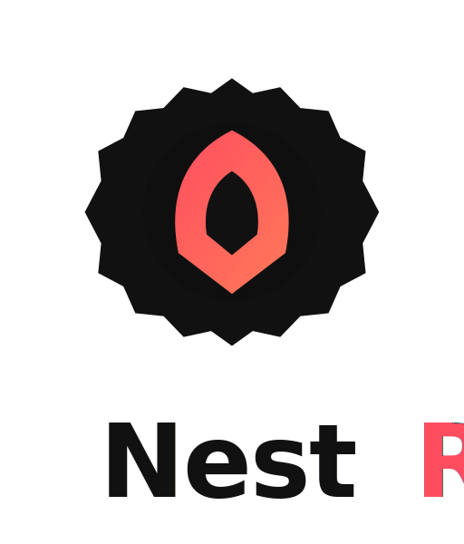

<p align="center">
  
</p>

<p align="center">
  <strong>Scalable Rust backend apps with native performance.</strong>
</p>

<p align="center">
  
  
  
  
</p>

> [!NOTE]
> **Alpha — under active development.** The API still shifts and rough edges
> remain, so it is not production-ready yet. Stars and early feedback are very
> welcome.

## Documentation

**Using NestRS?** Head to **[nestrs.dev](https://nestrs.dev)** — getting started,
tutorial, [why NestRS](https://nestrs.dev/why/), benchmarks, and one section per
capability crate.

**Contributing to the framework?** This README is your entry point. For design
rules and conventions, read [`CLAUDE.md`](CLAUDE.md) and
[`CONTRIBUTING.md`](CONTRIBUTING.md).

## Contributing

Anyone who can clone the repo can iterate on the framework — the dev container
brings up Rust, Postgres and Redis in one step.

### Get the dev container running

1. Install [Docker](https://docs.docker.com/get-docker/) and the VS Code
   [Dev Containers](https://marketplace.visualstudio.com/items?itemName=ms-vscode-remote.remote-containers)
   extension.
2. Open the repo in VS Code and accept **Reopen in Container**.
3. `just dev publish-api` — the main Publish API on `http://localhost:3002` (run `just db up` first).

The container provisions the Rust toolchain and dev tooling (`just`, `bacon`,
`cargo-nextest`, …), and brings up **Postgres** and **Redis** beside it with
`NESTRS_DATABASE__URL` / `NESTRS_QUEUE__URL` already pointed at them. `just dev`
runs under `bacon` — every save triggers an incremental rebuild and a restart.

> Prefer a local toolchain? See [Getting started → On your own machine](https://nestrs.dev/getting-started/#on-your-own-machine).

### Project layout

A Cargo workspace with three kinds of member.

```
nestrs/
├─ apps/               applications — one runnable binary each (the Publish workspace)
│  ├─ publish-auth/   OAuth2 / JWT token issuer
│  ├─ publish-api/    REST + GraphQL + OpenAPI, persisted & authorized
│  ├─ publish-assistant/  Model Context Protocol server
│  ├─ publish-live/   real-time WebSocket gateway
│  └─ publish-worker/ background jobs & scheduling (headless)
├─ crates/
│  ├─ features/        product features — port + adapters (users, posts, authn, …)
│  ├─ migrations/      shared-database SeaORM migrations (CLI)
│  ├─ seed/            shared-database demo data (CLI)
│  ├─ nest-rs-core/     IoC container, modules, DI, bootstrap
│  ├─ nest-rs-http/     REST controllers & routing
│  └─ …                one framework crate per capability
└─ docs/               the nestrs.dev site (Astro Starlight)
```

Simple **hello** and **blog** layouts are CLI-scaffolded only — see [Getting started](https://nestrs.dev/getting-started/) and the [tutorial](https://nestrs.dev/tutorial/). They are not checked into this repo.

- **`apps/<name>/`** — `main.rs` + `module.rs` listing the edge modules the binary serves. One repository, several independently shippable services.
- **`crates/nestrs-*/`** — the framework: generic, product-agnostic building blocks.
- **`crates/features/`** — the product's vertical slices (entity, service, policy, per-transport adapters). Apps import the edges they serve; the same feature code backs every binary.

Adding an app means adding a directory under `apps/`; a new feature means a folder under `crates/features/src/`; a new framework capability means a `nestrs-*` crate. The workspace picks all three up automatically (`members = ["crates/*", "apps/*"]`).

### Commands

Run `just` with no arguments to list every recipe.

| Command | What it does |
|---------|--------------|
| `just dev <app>` | Run an app in watch mode (rebuild + restart on change), e.g. `just dev publish-api` |
| `just run <app>` | Run an app in release mode, e.g. `just run publish-api` |
| `just build <app>` | Build one app in release (default `publish-api`), e.g. `just build publish-live` |
| `just build-all` | Build release binaries for every app in the workspace |
| `just test` | Run unit + integration tests (no DB) |
| `just test-e2e` | Run e2e tests (Postgres required) |
| `just test-cov` | Run coverage on the full suite |
| `just lint` | Clippy (strict) + format check |
| `just fmt` | Apply rustfmt |
| `just check` | Fast type-check (no codegen) |
| `just db <verb>` | Manage the shared database: `up`, `down`, `fresh`, `status`, `seed`, `reset` |

`build-all`, `test`, `test-cov`, `lint`, `fmt` and `check` operate on the
whole workspace; `dev`, `run`, and `build` take an app name (default `publish-api`);
`just db` (run bare to list the verbs) manages the shared Postgres schema and seed data.

### The Publish workspace

This repo ships **Publish** — a fictional multi-tenant publishing platform
told through six apps that share `crates/features/` and never RPC each other.
Full map: [nestrs.dev/publish](https://nestrs.dev/publish/).

| App | Kind | Port |
|-----|------|------|
| `publish-auth` | OAuth2 / JWT token issuer | 3001 |
| `publish-api` | REST + GraphQL + OpenAPI, persisted & authorized | 3002 |
| `publish-assistant` | Model Context Protocol server | 3003 |
| `publish-live` | Real-time WebSocket gateway | 3004 |
| `publish-worker` | Background jobs & scheduling (headless) | — |

`publish-api` and `publish-auth` need Postgres; `publish-worker` needs Redis
— run `just db up` once first (or `just db reset` to also load demo users).
`publish-assistant` and `publish-live` need neither.

The richest reference is `publish-api`. Read it before inventing a second
pattern — copy it to start a new feature; see [`CLAUDE.md`](CLAUDE.md) for the
rules a contributor (human or LLM) is expected to follow.

### Docker

A multi-stage [`Dockerfile`](Dockerfile) at the repo root builds **every
workspace binary** into a single image. Which one runs is chosen at
`docker run` time.

```bash
docker build -t nestrs .
docker run --rm -p 3002:3002 nestrs                              # default `publish-api`
docker run --rm -p 3001:3001 nestrs /usr/local/bin/publish-auth  # any other binary
docker run --rm nestrs /usr/local/bin/migrate up                 # apply migrations
```

Runtime image is `gcr.io/distroless/cc-debian13:nonroot` — no shell, no package
manager, runs as UID 65532. `cargo-chef` cooks dependencies in a cacheable
layer. Adding a new app under `apps/` requires no Dockerfile change.

## Community & contributing

NestRS is young, and early contributors shape what it becomes — you don't have
to write Rust to help.

- 💬 **Ask a question, propose an idea, or just say hi** in [Discussions](https://github.com/NestRS/NestRS/discussions).
- 🐛 **Report a bug or request a feature** through [issues](https://github.com/NestRS/NestRS/issues/new/choose).
- 🌱 **Pick up a** [`good first issue`](https://github.com/NestRS/NestRS/labels/good%20first%20issue) — [CONTRIBUTING.md](CONTRIBUTING.md) is the short path from idea to merged PR.
- 🗺️ **See where it's heading** in the [roadmap](ROADMAP.md).
- 🔒 **Found a vulnerability?** Follow [SECURITY.md](SECURITY.md) — please don't open a public issue for it.

If NestRS resonates, a ⭐ helps others find it and tells us the direction is worth
pushing.

## License

MIT — see [LICENSE](LICENSE).
