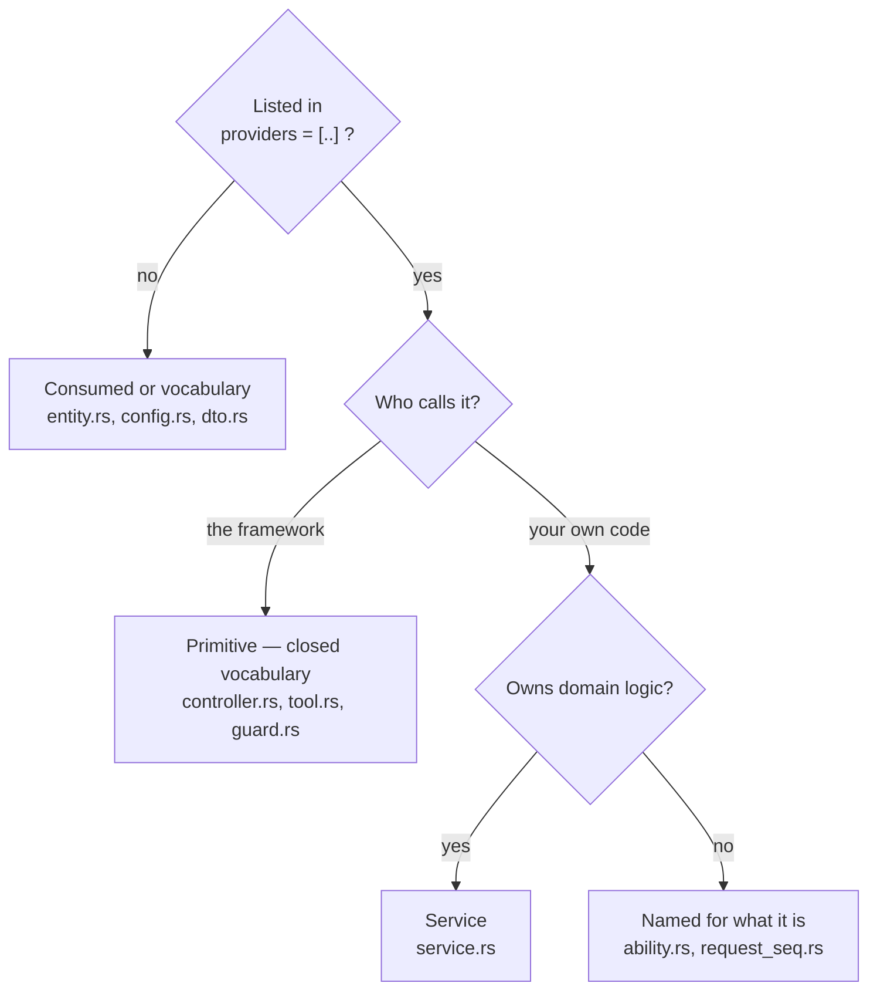

import { Aside, FileTree } from '@astrojs/starlight/components';

NestRS is opinionated about layout, and the opinions are worth knowing early:
they are what let you open someone else's feature and find the service without
looking. This page is the whole model — four naming levels, what a module file
is, and how to decide what to call a provider when the answer is not obvious.

One thing shapes everything below. `#[module]` carries two lists, `imports` and
`providers`, and nothing else — there is no `controllers` array. The mechanism
therefore cannot say what a given type is *for*. **The name has to.** Naming is
not decoration here; it is the only place that information lives.

## Four levels of name, and none overflows

| Level | Named for | Where it appears |
|---|---|---|
| **Project** | your product | the repository and the workspace, and nowhere else |
| **Crate** | what it holds | `crates/<crate>/`, and the root of every span target it emits |
| **App** | what it **serves** | `apps/<app>/`, the binary, `<App>Module` |
| **Module** | its **domain** | `<module>/`, `<Module>Module` |

<FileTree>
- apps/
  - api/ REST + GraphQL
  - worker/ queue consumer
- crates/
  - features/
    - users/
    - posts/
</FileTree>

An app is named for the workload it runs — `api`, `worker`, `auth` — not for the
product, because a product usually grows a second binary. A module is named for
its domain. **Nothing below the composition root carries the project's name or
the app's**: the project name stops at the workspace, the app name stops at
`<App>Module`. A single-app project may name its app after itself, and even then
nothing beneath it may.

Module names are plural when the domain is a collection you can enumerate
(`users`, `orders`) and singular when it is a capability (`auth`, `search`).
That one is not cosmetic — `nestrs g resource` singularizes the folder name to
derive the entity, so `users/` yields `User` and a wrongly pluralized module
yields a wrongly named entity.

## Two module files, two jobs

Rust needs to be told which files exist; the framework needs to be told which
providers exist. Those are different questions, so they live in different files
and are never merged.

| File | Answers to | Holds |
|---|---|---|
| `mod.rs` | the compiler, and readers | `//!`, `mod`, `pub use` |
| `module.rs` | the framework | exactly one `#[module]` |

`module.rs` is the DI module. `mod.rs` is the folder index **and the export
contract**: NestRS has no `exports` list, because Rust already has one. What a
feature's `mod.rs` re-exports is what the rest of the workspace can reach;
everything else stays `pub(crate)` or private, and a type nobody can name is a
type nobody can inject.

```rust title="crates/features/src/users/mod.rs (from the demo)"
mod entity;
mod module;
mod service;

pub use entity::User;
pub use module::UsersModule;
pub use service::UsersService;
```

<Aside type="tip">
A `mod.rs` that re-exports everything cancels the encapsulation. That list is a
decision about your feature's surface, not plumbing.
</Aside>

There is never a `*_module.rs`: one `#[module]` per file, one `module.rs` per
folder. Two modules in a feature means two folders — which is exactly what a
[transport adapter](/fundamentals/modules/#extract-a-feature) is.

## Naming a provider — three questions

Work down the list. The first one that answers settles the name.



**Is it in `providers`?** If not, it is not a provider. It is either something
the framework reads without injecting — an entity, a `#[config]`, a DTO the
validator walks — or plain vocabulary: an enum, a type alias, a set of
constants. Neither needs a module of its own. **Only a type injected by type
does**, which is why a social provider reached through its registry has no
module while a service has one.

**Who calls it?** If the framework calls it *because of what it is*, the role
word is a dispatch contract and the vocabulary is closed: you pick from the
table below rather than invent. If your own code calls it, keep going.

**Does it own domain logic?** If yes, it is a `Service` — the residue, by
design. If no, name it for what it is: a factory, a client, a store, a
registry, a transport seam. Never `Service`, and never folded into
`service.rs`.

## The role table

The file is named for the role, never for the type.

| Role | File |
|---|---|
| DI module | `module.rs` |
| Folder index | `mod.rs` |
| Service | `service.rs` / `services/` |
| Controller / Resolver / Gateway | `http/controller.rs` / `graphql/resolver.rs` / `ws/gateway.rs` |
| Processor / Scheduled tasks / Tool | `queue/processor.rs` / `schedule/tasks.rs` / `mcp/tool.rs` |
| Event listener host | `events/listener.rs` |
| Entity | `entity.rs` / `entities/` |
| Guard / Strategy / Pipe | `guard.rs` / `strategy.rs` / `pipe.rs` |
| Interceptor / Filter / Exception filter | `interceptor.rs` / `filter.rs` / `exception_filter.rs` |
| Module config | `config.rs` |
| Domain error / Constants | `error.rs` / `constants.rs` |

An adapter role carries its folder: `schedule/tasks.rs`, never `tasks.rs` at the
module root, and a transport-specific guard belongs to its adapter too —
`mcp/guard.rs`, not `guard.rs` beside the service.

The layer roles sit on that table because the framework dispatches to them
exactly as it does to a guard or a pipe. Same placement rule: a layer serving
one transport lives in that transport's folder (`http/interceptor.rs`), a layer
a module applies to itself whatever the edge sits flat at the module root — and
a crate whose whole subject *is* one layer keeps it at the crate root, since
there is no second adapter for a folder to separate it from.

Shared test doubles are the one file that sits at a crate's root rather than in
a module: `testing.rs`, behind `#[cfg(test)]`, doubles and nothing else.

A primitive role wins over `Service` **only when the framework is the sole
caller and the file holds no domain logic**. A `tasks.rs` earns its name when
the clock is the only thing that calls it and the work lives in a service;
otherwise it is a service that happens to have a trigger. A lifecycle hook
never renames a service.

## The name everything else takes

The table above covers what the framework dispatches to. Everything else — a
custom provider, an enum, a value object, a set of constants — is named by one
rule:

**The file and its folder, read together, spell the type.** One of the two
names the *kind*, never both and never neither — and every shape that takes is
already in the crates you import. The kind is the subject in
`seaorm/src/repo.rs` → `Repo` and `core/src/container.rs` → `Container`, so
neither word has to add one. The file names the kind in
`redis/src/connection.rs` → `RedisConnection` and `events/src/bus.rs` →
`EventBus`, and the type prepends the subject. The folder names it in
`pipes/src/pipes/validation.rs` → `ValidationPipe`, and the file names the
subject.

**One shape is refused, and only one: a stem that appears nowhere in what the
file declares.** No example of it appears above, and that is the point — the
framework holds none, because a real one is a defect to fix rather than a case
to publish. So this half of the rule is applied rather than recognised, as a
question: **does either name reach the other?** When no word of the stem
reaches the type and no word of the type reaches the stem, the file was named
for a *slot* — "who acts", "what we pass around" — instead of a subject, and a
slot has no admission test, so the next type about that slot lands there too.
It is a `shared/` folder at the scale of a file, and it is invisible from
outside: both names read perfectly well alone, and only the pair is wrong.

Everything short of that passes, and the tolerance is deliberate. The shared
word may come from the folder rather than the file — `throttler/store.rs` holds
`RedisThrottler`, because a binding file names the seam and the type names the
thing that fills it. An inflection is the same word, and so is a word in the
middle: `scope.rs` holds `Scoped`, `token.rs` holds `AccessTokenRequest`.

A file whose principal export is **not** a type is a namespace instead, and
owes nothing above: `queue/src/consume.rs` exports `consume::discover` and
`consume::attempt`, and the `Attempt` it also declares is that procedure's
vocabulary rather than the file's subject. The stem names what a caller
*calls*, and the call site reads it as part of the name. A file whose subject
*is* a type owes the pairing.

## When a role repeats

Pluralized sub-folder. The singular trait file stays at the parent — and the
folder exists to carry *several*, so one of a kind is a file: a module with a
single transfer object writes `dto.rs` at its root rather than a `dtos/` holding
one entry. A plural folder with one file in it names a collection that is not
there.

| Folder | File | Type |
|---|---|---|
| `services/`, `strategies/`, `pipes/` | bare: `input.rs` | `InputService` |
| `entities/` | bare: `user.rs` | `User` |
| `dtos/`, `commands/`, `events/` | suffixed: `login_dto.rs` | `LoginDto` |

A provider's role is already spelled by its folder and its type, so the file
does not spell it a third time. A transfer object is read far from its folder —
in a handler signature — so it keeps the suffix at both ends.

Two services in one module is a last resort. Extracting a factory or an enum
leaves the count at one, and that is the common case.

## What a folder may not be called

A module's sub-folders are a closed set of two kinds: **transport adapters**
(`http/`, `graphql/`, `ws/`, `queue/`, `schedule/`, `mcp/`, `events/`) and
**pluralized role folders** (`services/`, `entities/`, `dtos/`, …). There is no
third kind. A folder invented to group things that go together — `contract/`,
`types/`, `core/`, `shared/` — hides its files from the tables above, and every
one of them already has a name. A folder that feels too full means the module
is too big.

The same reasoning rules out a `shared` crate one level up. A crate is named
for *what it holds*; "shared" and "common" name *who reaches for it*, so they
admit anything and refuse nothing. A substrate crate is shared *because* it
holds the substrate, never the other way round — and if the subject cannot be
named in one noun, the sharing is accidental: the vocabulary belongs to the
module that owns it, and a second consumer is the signal that two modules were
drawn wrong.

`core` is the one positional word that survives, and it survives on a test: it
names the kernel rather than an audience, and a kernel is checkable — *every
other crate composes on it, and it composes on none of them*. A `core` that
fails that test is a `shared` wearing a better word.

Module names themselves avoid the structural vocabulary, because reusing one
makes every path ambiguous:

```
structure   apps  crates  features  src  tests
roles       mod  module  service  controller  resolver  gateway  tool
            processor  tasks  listener  guard  strategy  pipe  config
            interceptor  filter
            entity  error  constants  testing
singulars   dto  command  event
plurals     services  entities  dtos  commands  events  strategies  pipes
edges       http  graphql  ws  queue  schedule  mcp  events
```

A module about desktop applications is `programs/`, not `apps/`.

## The rules travel with your code

`nestrs new` writes all of the above into your project as `AGENTS.md`, beside a
`CLAUDE.md` that imports it. Both are committed, so the conventions reach every
contributor and every coding agent working in the repository without anyone
having to remember this page. The framework builds that file from the same
source it works under itself, so the two cannot disagree.

If you adopt NestRS in an existing project, copying that file in is the fastest
way to get the same effect.

## Going further

- **[Modules](/fundamentals/modules/)** — how imports compose, and the
  boot-time access graph that rejects a provider reaching outside its module.
- **[Providers](/fundamentals/providers/)** — scopes, `provide_dyn`, and hiding
  an implementation behind a trait.
- **[CLI](/cli/)** — the generators that write this layout, including the wiring
  edits a copy cannot carry.
- **[Coming from NestJS](/coming-from-nestjs/)** — how `@Module` maps onto
  `#[module]`, and where the two diverge.
