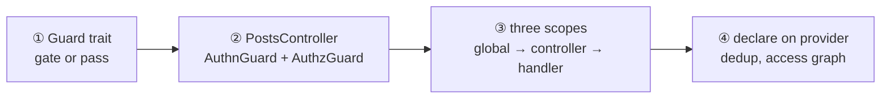
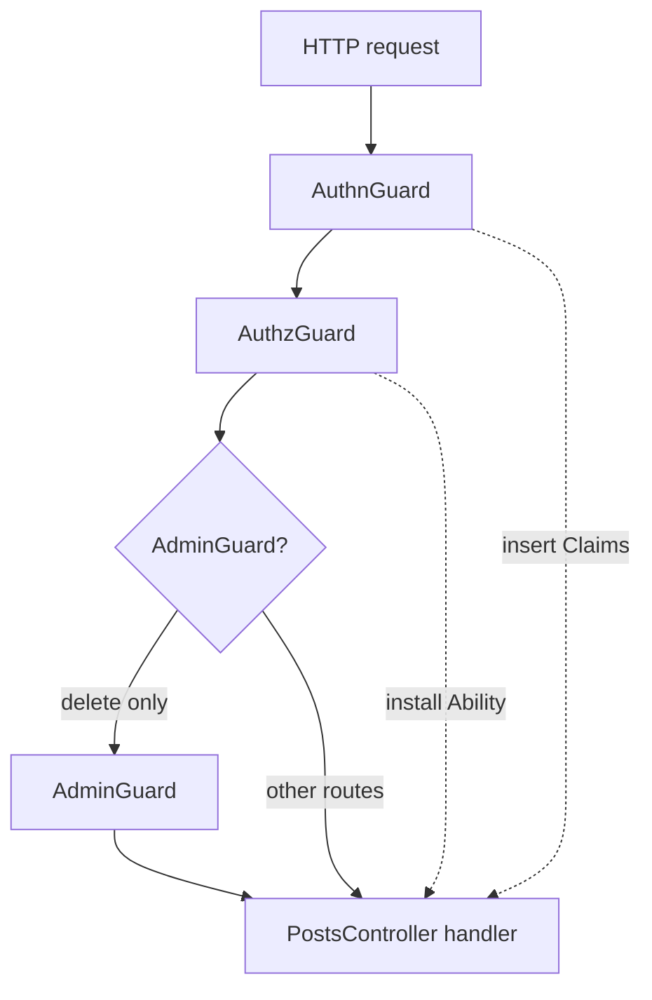
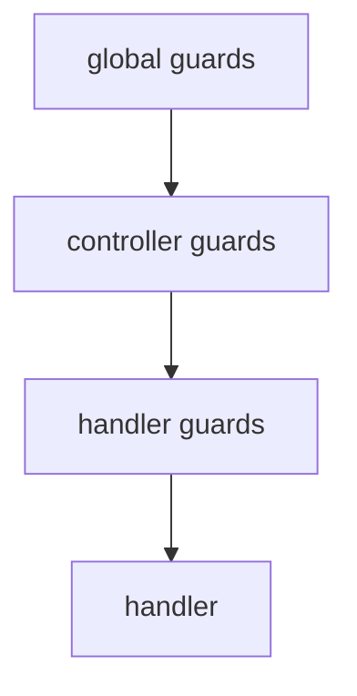
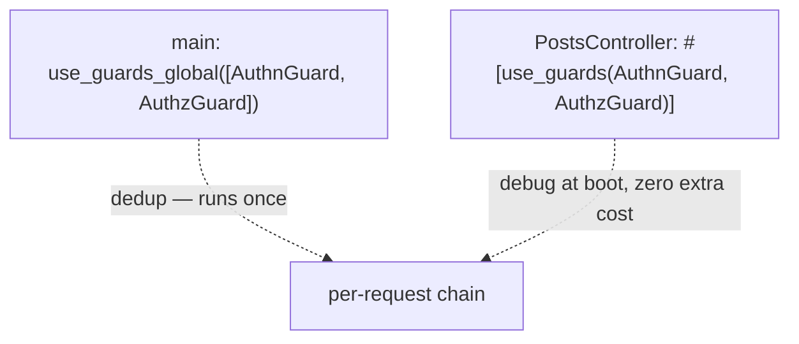

import { Aside, FileTree } from '@astrojs/starlight/components';

This page continues **`blog`** from
[Modules](/fundamentals/modules/) and
[Providers](/fundamentals/providers/) — the composed stage before you
open the [tutorial](/tutorial/) `posts/` feature. Once `PostsHttpModule` mounts
`PostsController`, guards decide *who* reaches each handler — and often
attach the principal the handler reads back via `Ctx<T>`.

Four steps on this page:

1. **What a guard is** — one trait, four transports, `Ok(())` or
   [`Denial`](https://docs.rs/nest-rs-guards/latest/nest_rs_guards/enum.Denial.html).
2. **Secure the post API** — `#[use_guards(AuthnGuard, AuthzGuard)]` on
   `PostsController`, with the modules that provide those guards.
3. **Three scopes** — global, controller, per-handler; additive, not
   substitutive.
4. **Declare on the provider** — dedup by `TypeId`; redeclare at the
   controller so security travels with the feature.


```mermaid
flowchart LR
  A["① Guard trait<br/>gate or pass"] --> B["② PostsController<br/>AuthnGuard + AuthzGuard"]
  B --> C["③ three scopes<br/>global → controller → handler"]
  C --> D["④ declare on provider<br/>dedup, access graph"]
```

## Install

```bash frame="terminal"
cargo add nest-rs --features guards
```

The `http` feature turns this on, and `http` is a default — name it explicitly only in a headless app built with `default-features = false`, where no transport implies it.

## What a guard does

A guard runs *before* the handler. It sees the request first and either
lets it through (`Ok(())`) or short-circuits with a typed `Denial` the
framework maps to 401 / 403 / 429. One trait, four transports — the same
`#[injectable]` impl is reachable from HTTP, GraphQL, WS and MCP through the
[the request lifecycle](/fundamentals/request-lifecycle/).

`Guard` ships in
[`nest-rs-guards`](https://crates.io/crates/nest-rs-guards). It extends
[`Layer`](https://docs.rs/nest-rs-core/latest/nest_rs_core/trait.Layer.html)
so guards plug into dedup-by-`TypeId` and declaration-order chaining.

### A minimal custom guard

```rust title="src/posts/guard.rs"
use nest_rs::guards::prelude::*;
use nest_rs::http::poem::Request as HttpRequest;

#[injectable]
#[derive(Default)]
pub struct RateLimitGuard;

impl Layer for RateLimitGuard {}

#[async_trait]
impl Guard for RateLimitGuard {
    async fn check_http(&self, req: &mut HttpRequest) -> Result<(), Denial> {
        if over_quota(req) {
            return Err(Denial::rate_limited(60, "rate limited"));
        }
        Ok(())
    }
}

impl HttpGuard for RateLimitGuard {}
```

That last line attests the edge you implemented — see
[A guard must declare the transports it checks](#a-guard-must-declare-the-transports-it-checks)
below. Without it, binding this guard on a route is a compile error.

A guard is an `#[injectable]` provider listed in some module's
`providers = [...]`. The access graph (see
[Providers](/fundamentals/providers/#the-access-graph--wiring-checked-at-boot))
ensures every controller / resolver / gateway that references it imports
a module that builds it.

The trait carries one method per transport. Unimplemented transports
inherit `Ok(())` — that means "doesn't apply here", not "skip security".
Other guards on the same route still run.

| Method | Transport | Request shape |
|--------|-----------|---------------|
| `check_http` | HTTP | `&mut HttpRequest` — gate and mutate (attach context in extensions) |
| `check_graphql` | GraphQL | `&GraphqlOperationContext` — read-only; seed context upstream |
| `check_ws_message` | WS | per inbound message, after the upgrade |
| `check_mcp` | MCP | per operation, inside rmcp's dispatch — the ability is ambient |

```rust
#[async_trait]
pub trait Guard: Layer {
    async fn check_http(&self, _req: &mut HttpRequest) -> Result<(), Denial> { Ok(()) }
    async fn check_graphql(&self, _op: &GraphqlOperationContext<'_>) -> Result<(), Denial> { Ok(()) }
    async fn check_ws_message(&self, _client: &WsClient, _event: &str, _data: &Value)
        -> Result<(), Denial> { Ok(()) }
    async fn check_mcp(&self, _ctx: &McpOperationContext<'_>) -> Result<(), Denial> { Ok(()) }
}
```

## Secure the post API

After [Modules](/fundamentals/modules/#extract-a-feature), `PostsController`
lives under `posts/http/`. Binding guards on the struct is how you gate
every route on that controller — and declare the auth modules the access
graph must reach.

```rust title="crates/features/src/posts/http/controller.rs"
use std::sync::Arc;
use nest_rs::authz::Read;
use nest_rs::http::{controller, routes};
use nest_rs::seaorm::Bind;
use nest_rs::http::poem::web::{Json, Path};
use nest_rs::http::poem::Result;
use uuid::Uuid;

use crate::authn::AuthnGuard;
use crate::authz::AuthzGuard;
use crate::posts::{AdminGuard, Post, PostsService};

#[controller(path = "/posts")]
#[use_guards(AuthnGuard, AuthzGuard)]
pub struct PostsController {
    #[inject]
    svc: Arc<PostsService>,
}

#[routes]
impl PostsController {
    #[get("/:id")]
    async fn get(&self, post: Bind<Read, PostsService>) -> Json<Post> {
        Json(Post::from(&*post))
    }

    #[delete("/:id")]
    #[use_guards(AdminGuard)]
    async fn delete(&self, id: Path<Uuid>) -> Result<()> {
        self.svc.delete(*id).await
    }
}
```

`AdminGuard` runs *on top of* the controller's two guards. Per-handler
binding is **additive** — it does not replace the controller list.

A route with no guards stays open, but silence is not a decision: the boot
reports every route that binds no guard and is not marked `#[public]` in a
single `warn` naming them ([below](#declare-on-the-provider)). Declaring
the posture — a guard, or `#[public]` — is what makes it intentional.

The HTTP adapter imports the auth bridges transitively — same pattern as
`UsersHttpModule` in the repo:

```rust title="crates/features/src/posts/http/module.rs"
#[module(
    imports = [PostsModule, AuthzModule],
    providers = [PostsController],
)]
pub struct PostsHttpModule;
```

```rust title="crates/features/src/authn/module.rs"
#[module(
    imports = [nest_rs::authn::AuthnModule::for_root(None)],
    providers = [AuthnStrategy, AuthnGuard],
)]
pub struct AuthnModule;
```

```rust title="crates/features/src/authz/module.rs"
#[module(
    imports = [AuthnModule],
    providers = [AuthzAbility, AuthzGuard],
)]
pub struct AuthzModule;
```

`AuthzGuard` is provided here rather than under `authz/http/` because
`AbilityGuard` answers every transport — it implements `check_http`,
`check_graphql`, `check_ws_message` and `check_mcp`. A resolver, a gateway and
an MCP host bind the same type, so none of them imports an HTTP adapter to
reach it.

<FileTree>
- crates/features/src/
  - authn/
    - module.rs (AuthnModule — provides AuthnGuard)
    - strategy.rs (AuthnGuard — the alias, beside the strategy it wraps)
  - authz/
    - module.rs (AuthzModule — provides AuthzAbility + AuthzGuard)
    - guard.rs (AuthzGuard — answers every transport)
  - posts/
    - http/
      - module.rs (PostsHttpModule — imports AuthzModule)
      - controller.rs (#[use_guards(AuthnGuard, AuthzGuard)])
</FileTree>


```mermaid
flowchart TB
  REQ[HTTP request] --> AG[AuthnGuard]
  AG --> AZ[AuthzGuard]
  AZ --> AD{AdminGuard?}
  AD -->|delete only| ADG[AdminGuard]
  AD -->|other routes| H[PostsController handler]
  ADG --> H
  AG -. "insert Claims" .-> H
  AZ -. "install Ability" .-> H
```

Solid arrows are the guard chain on `GET /posts/:id`. `DELETE` adds
`AdminGuard` on top. `AuthnGuard` attaches `Claims`; `AuthzGuard` builds
the ambient `Ability` handlers and `Bind` read through.

## The three scopes

A guard binds at one of three scopes. The container resolves all three
from the same provider — declare once, choose *where* it runs.

| Scope | Binding | Resolved by |
|-------|---------|-------------|
| **Global** | `App::builder().use_guards_global([guard::<AuthnGuard>()])` in `main` | Per-route shaper, post-routing (self-mount edge for gateways) |
| **Controller / Resolver / Gateway** | `#[use_guards(AuthnGuard, AuthzGuard)]` on the struct | Container, at mount |
| **Per-handler** | `#[use_guards(AdminGuard)]` beside a verb / `#[query]` / `#[subscribe_message]` | Container, at mount |

Multiple guards in one attribute run in **declaration order**, outermost
first — the first listed sees the request before the second.

```rust title="apps/blog/src/main.rs"
use nest_rs::guards::{AppBuilderGuardsExt, guard};
use crate::authn::AuthnGuard;
use crate::authz::AuthzGuard;

App::builder()
    .use_guards_global([guard::<AuthnGuard>(), guard::<AuthzGuard>()])
    .module::<BlogModule>()
```

Across scopes the chain composes **global → controller → handler**,
outermost first. `Layer::priority` is an optional tiebreaker when
declaration order cannot express intent — most guards leave it at `0`.


```mermaid
flowchart TB
  G[global guards] --> C[controller guards]
  C --> H[handler guards]
  H --> R[handler]
```

## Where guards run in the chain

Guards are pooled by `TypeId` and execute **once per request**, post-routing at the `RouteShaper` — so a global guard still reads `#[public]` route data, and a guard denial short-circuits before the route's interceptors run. The full family-by-family nesting (guards vs pipes vs interceptors vs filters, and why `DbContext` wraps the guards) lives on [the request lifecycle](/fundamentals/request-lifecycle/).

## Attach context and route metadata

Guards often do more than gate — they produce values the handler needs.
Attach on the way in; read with `Ctx<T>`:

```rust
#[async_trait]
impl Guard for AuthnGuard<MyStrategy> {
    async fn check_http(&self, req: &mut HttpRequest) -> Result<(), Denial> {
        let claims = self.strategy.authenticate(req).await?;
        req.extensions_mut().insert(claims);
        Ok(())
    }
}

impl HttpGuard for AuthnGuard<MyStrategy> {}

#[get("/me")]
async fn me(&self, auth: Ctx<Claims>) -> Json<Post> {
    Json(self.svc.find_by_author(auth.sub).await?)
}
```

`Ctx<T>` rejects with 500 if the value is absent — a missing context
means the guard that should have set it never ran. Store an `Arc<_>` if
the value is large.

`AuthzGuard` reads `Claims` left by `AuthnGuard` to build the ambient
`Ability`. That is why order matters:
`#[use_guards(AuthnGuard, AuthzGuard)]`, not the reverse.

For per-route policy — required roles, rate-limit quotas — `#[meta(...)]`
attaches a typed payload; `Reflector` reads it inside the guard:

```rust
#[get("/admin/audit")]
#[use_guards(AuthnGuard, RolesGuard)]
#[meta(Roles(&["admin", "auditor"]))]
async fn audit(&self) -> &'static str { "ok" }
```

Because the global pool runs post-routing at the `RouteShaper` (above), a
global guard reads `#[meta(...)]` too — the route data is attached before
the chain runs, exactly as it is for `#[public]` below.

`#[public]` uses the same channel. The framework does **not** act on it —
each guard decides what "public" means (`AuthnGuard` may authenticate when
a token is present but not reject anonymous callers; `AuthzGuard` may
still apply visitor rules). Marking a route public does not strip its
guards; it tells them to relax.

## Declare on the provider

The Layer System dedups every layer by
[`TypeId`](https://doc.rust-lang.org/std/any/struct.TypeId.html) across
the three sites. When the same guard is declared at several levels, the
**broadest site wins**; narrower declarations log a `debug` line at boot
(deduped once on `nest_rs::layers`) but never re-execute.

```rust title="apps/blog/src/main.rs"
App::builder()
    .use_guards_global([guard::<AuthnGuard>(), guard::<AuthzGuard>()])
    .module::<BlogModule>()
```

```rust title="crates/features/src/posts/http/controller.rs"
#[controller(path = "/posts")]
#[use_guards(AuthnGuard, AuthzGuard)]
pub struct PostsController { /* ... */ }
```

`AuthnGuard` and `AuthzGuard` run **exactly once** per request, not twice.
The controller's two extra lines cost zero runtime overhead and one `debug`
line at boot.

### Re-running one on purpose: `#[force_guards]`

Dedup is what makes redeclaring free, so the one thing it takes away is
running a guard *twice on purpose*. `#[force_guards(...)]` is the opt-out,
and it takes the same list `#[use_guards]` does:

```rust
#[patch("/:id/publish")]
#[force_guards(FreshTokenGuard)]        // replay, even though the pool ran it
#[authorize(Update, PostEntity)]
async fn publish(&self, post: Bind<Update, PostsService>) -> Result<Json<Post>> { /* ... */ }
```

Reach for it when a guard's answer can go stale between the pool's site and
the handler — a token freshness re-check on a sensitive mutation, a quota
counted per operation rather than per request. Everywhere else it is a second
execution nobody asked for, so the default stays dedup.

**Per operation only.** `#[use_guards]` binds on the struct or the method;
`#[force_guards]` is read only from the method, because re-running a guard is a
decision about one operation rather than a posture a whole controller takes.
Writing it on the struct is `cannot find attribute 'force_guards' in this
scope`.

**Declare layers on the provider that needs them, not only at the app
boundary.** A `crates/features` controller is designed to be portable — if
it relies only on `use_guards_global([...])` to be secure, forgetting
that line in a second app turns every route public. The compiler will not
complain — but boot now does: with **no global guard pool active**, every
route that binds no controller/method guard and is not marked `#[public]`
is reported in a single `warn` on `nest_rs::layers` (an *implicit* access
decision). The fix is the same either way: redeclare on `PostsController`
to bind the policy to the code that needs it, or mark genuinely-open
routes `#[public]` on purpose. The same rule applies to interceptors and
filters.


```mermaid
flowchart TB
  MAIN["main: use_guards_global([AuthnGuard, AuthzGuard])"]
  PC["PostsController: #[use_guards(AuthnGuard, AuthzGuard)]"]
  MAIN -. "dedup — runs once" .-> RUN[per-request chain]
  PC -. "debug at boot, zero extra cost" .-> RUN
```

## HTTP, GraphQL, WebSockets, and MCP

For most apps the global HTTP declaration is enough: GraphQL
`POST /graphql`, `POST /mcp` and the WS upgrade are all HTTP requests that pass
through the global chain. `/graphql` and `/mcp` are `Exempt` at the HTTP edge
and gate **in-band** instead: with no bridge registered, their endpoint runs the
pool's `check_http` over the request, and either way the pool joins the
per-operation chain, where its `check_graphql` / `check_mcp` runs. So
`use_guards_global([...])` reaches every transport at every method it
implements — a global `ThrottlerGuard` rate-limits a tool call through
`check_http`, and a global guard written against `check_mcp` refuses one.

Each transport method runs at a different seam:

- `check_http` — on `&mut HttpRequest`, post-routing at the route site
  (before the handler, so it can read `#[public]` route data).
- `check_graphql` — inside the resolver's per-operation chain (context
  is read-only), **and** in front of the two federation root fields
  `_service` / `_entities`, which async-graphql resolves above the merged root.
  That second site is why the argument is a `GraphqlOperationContext` rather
  than async-graphql's `Context`: a schema extension is the only seam there and
  it is handed no `Context`. Read data with `op.data_opt::<T>()`; reach for
  `op.context()` when you genuinely need the selection set — it answers `None`
  on a federation field rather than inventing one.
- `check_ws_message` — once per inbound message, after the connection
  upgrade.
- `check_mcp` — once per `#[tool]` / `#[prompt]` operation, inside rmcp's
  dispatch. The context carries the app and which operation is running; the
  caller's `Ability` is ambient, so a capability-only guard reads it with
  `current_ability()`.

GraphQL, WS and MCP need a bridge one level above the resolver / gateway / tool
because the per-operation context does not carry the poem request:

- **GraphQL** — a `GraphqlOperationGuard` (e.g. `GraphqlAbilityBridge`)
  re-runs the HTTP guard chain on `POST /graphql` and installs `Ability`
  for the operation. Per-resolver gating binds the ability guard.
- **MCP** — an `McpOperationGuard` (e.g. `McpAbilityBridge`), the exact twin:
  same chain, same `around` installing `Ability` — here *inside* rmcp's
  spawned dispatch. With none registered the endpoint falls back to the global
  pool, and with no pool either it is deny-all. Above it, `#[use_guards(...)]`
  binds ordinary guards per host and per operation, and the global pool joins
  them in one chain deduplicated by type. The endpoint guard does not shorten
  that chain: it is handed a request and runs `check_http`, while the chain is
  handed the operation and runs `check_mcp` — two questions, so neither answers
  the other.
- **WS** — a `SocketContext` (e.g. `WsDataContext`) captures pool +
  `Ability` on upgrade and re-installs them around each message.
  Per-message gating goes through `check_ws_message`.

On a resolver, `#[use_guards(...)]` binds the **ability guard** — the one
that has a `check_graphql`. Authentication is not bound here: the bridge
already ran it in band before the operation, so listing an `AuthnGuard`
on a resolver would bind a guard with nothing to do.

```rust
#[resolver]
#[use_guards(AuthzGuard)] // AbilityGuard<AuthzAbility> — has check_graphql
pub struct PostResolver { /* ... */ }
```

The principal reaches `ctx` through `forward_principal!(Claims)`, declared
once beside `AuthzGraphqlModule`. It is not a guard and binds nothing: it
copies `Claims` off the request **only if something already attached them**,
and the only thing that does is the authn guard the bridge ran in band. So the
gate is that guard, which its own module already gates — an anonymous request
passes through untouched, and there is no marker type to declare or forget.

WebSockets need no marker type either — the upgrade is a real HTTP `GET`,
so the gateway struct binds the **real** HTTP guards; they run once at
the upgrade and are access-graph-validated the same way (omit
`AuthzWsModule` and the guards are unreachable ⇒ boot fails). A
per-message check binds a real `Guard` beside the
`#[subscribe_message]`; it runs through `check_ws_message` — e.g.
`AuthzGuard` (the app's `AbilityGuard<AuthzAbility>` alias) denies,
fail-closed, when no ambient ability is present.

```rust
#[gateway(path = "/posts/live")]
#[use_guards(AuthnGuard, AuthzGuard)] // real guards — run once, at the upgrade
pub struct PostGateway { /* ... */ }

#[messages]
impl PostGateway {
    #[subscribe_message("comment")]
    #[public]
    #[use_guards(AuthzGuard)] // re-checked per message via check_ws_message
    async fn comment(&self, msg: CommentInput) -> Reply { /* ... */ }
}
```

### A guard must declare the transports it checks

Every `check_*` above defaults to `Ok(())` — right as "this guard does not
apply to that transport", and the reason a guard bound where it has no
entry used to compile and pass everything. Four marker traits close that:

| Bound at | Requires | Because it runs |
|---|---|---|
| `#[controller]` / `#[routes]`, `#[gateway]` struct | `HttpGuard` | `check_http` |
| `#[resolver]` / `#[operations]` | `GraphqlGuard` | `check_graphql` |
| beside a `#[subscribe_message]` | `WsGuard` | `check_ws_message` |
| `#[mcp]` host / `#[tools]` operation | `McpGuard` | `check_mcp` |

Declare the marker next to the `check_*` it attests — `impl GraphqlGuard
for RequireAdmin {}` — and the binding compiles. Bind a guard that lacks
one and it does not, with a diagnostic naming the missing method and the
two ways out:

```text frame="terminal"
error[E0277]: `ThrottlerGuard` does not check GraphQL operations
   |
   | #[use_guards(ThrottlerGuard)]
   |              ^^^^^^^^^^^^^^ this guard has no `check_graphql`
   = note: override `check_graphql`, then declare `impl GraphqlGuard for ThrottlerGuard {}`;
           or bind this guard on an HTTP `#[controller]` / `#[routes]` instead
```

The marker never proves the *method* exists — the `Ok(())` default gives
every guard all four. It proves you **declared** that this guard checks
this edge. An empty `impl Guard for X {}` satisfies the compiler and
passes every request; the marker is what turns that into an error at the
`#[use_guards]` line rather than a chain entry that guards nothing.

A guard bound **globally** takes no marker, and that is a deliberate hole
rather than an oversight: a global guard serves whichever edges it
implements — its `check_http` on the request, its `check_graphql` /
`check_mcp` on the operation — so requiring `HttpGuard` there would refuse a
GraphQL-only one, and the alternative is four global lists where the developer
wrote one. So an empty guard registered globally still passes everything: the
markers bind `#[use_guards]` sites, not the pool.

A guard on the `#[gateway]` **struct** attests `HttpGuard`, not `WsGuard` —
the upgrade is an HTTP `GET`, and `WsGuard` belongs to the per-message scope.

See [Security / per-transport bridges](/security/authorization/per-transport-bridges/)
for the full HTTP / GraphQL / WS wiring, and
[WebSockets / Guards](/websockets/guards/) for the two WS scopes
(connection vs message).

<Aside type="note" title="What to remember">
- **Guard** — `#[injectable]` provider; `Ok(())` passes, `Denial`
  short-circuits with a typed status.
- **Three scopes** — global, controller, handler; compose outermost-first;
  per-handler is additive.
- **Declare on the provider** — `#[use_guards(...)]` on `PostsController`
  binds security to the feature; global + controller dedup to one run.
- **Order matters** — `AuthnGuard` before `AuthzGuard`; global
  interceptors outside global guards (`DbContext` before `AuthzGuard`).
</Aside>

## Going further

- [Providers](/fundamentals/providers/) — the access graph also governs
  `#[use_guards(...)]` bindings.
- [Interceptors](/fundamentals/interceptors/) — the sibling layer; wraps
  the handler instead of gating it. Same dedup rules apply.
- [Pipes](/fundamentals/pipes/) — input transform / validation.
- [Error handling](/fundamentals/exception-filters/) — typed catch for
  handler errors.
- [Security](/security/) — `AuthnGuard`, `AbilityGuard`, the full chain.
