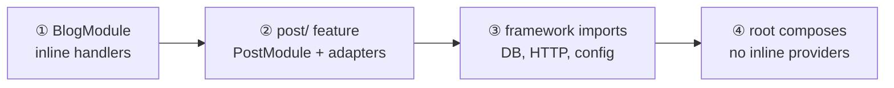
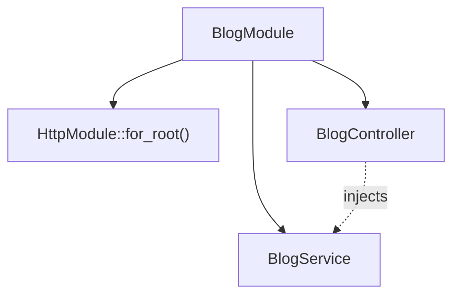
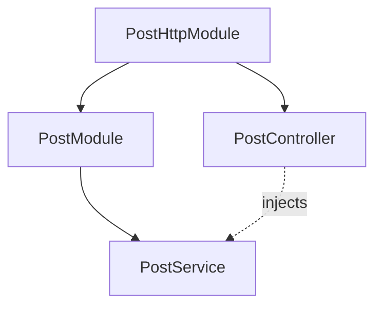
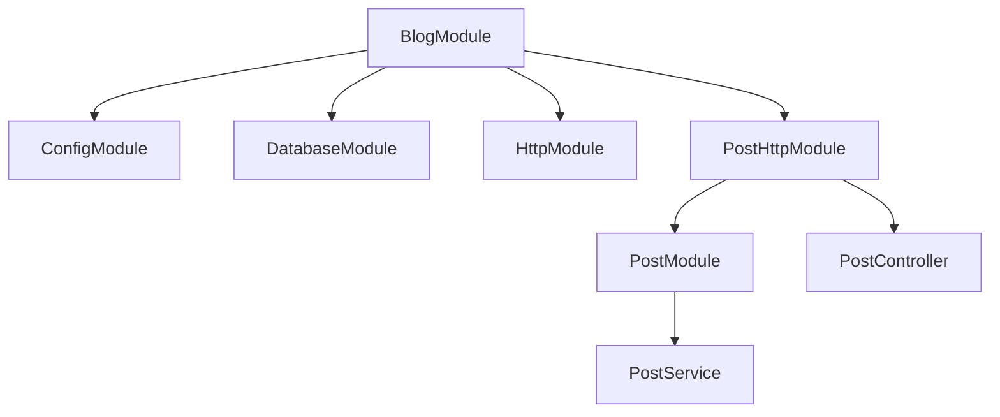
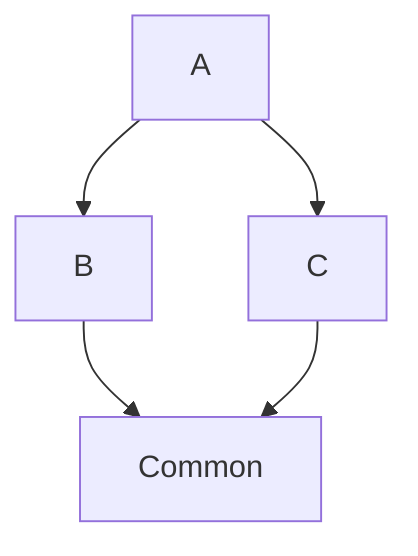

import { Aside, FileTree } from '@astrojs/starlight/components';

Every NestRS binary is a tree of modules. This page walks one fictional
app — **`blog`** — through four steps:

1. **One root module** — handlers inline, one transport.
2. **Extract a feature** — domain code moves to `post/` with its own prefix.
3. **Wire imports** — static vs dynamic framework modules.
4. **Compose** — the root lists imports only; adapters own the handlers.

The snippets are illustrative. Step ① matches the
[Fundamentals](/fundamentals/) tour — the same `BlogModule` grows on the
rest of this page.



## Start with one module

A module is a struct decorated with `#[module(...)]`. It declares two
things: the **providers it owns** (built and registered into the
container) and the **modules it imports** (whose providers it can
inject).

At the smallest scale, handlers live in the app itself:

```rust title="apps/blog/src/module.rs"
use nest_rs_core::module;
use nest_rs_http::HttpModule;
use crate::controller::BlogController;
use crate::service::BlogService;

#[module(
    imports = [HttpModule::for_root(None)],
    providers = [BlogService, BlogController],
)]
pub struct BlogModule;
```

`BlogModule` activates HTTP and registers its own service and controller.
Providers in the same module share its name prefix — here, `BlogService`
and `BlogController`.



## Two lists, one purpose

| List | Holds | Purpose |
|------|-------|---------|
| `providers = [...]` | Injectable structs this module builds — services, controllers, … | Registered into the flat container |
| `imports = [...]` | Other modules — by type or by `Module::for_root(opts)` | Their providers become injectable here |

A provider listed by another module cannot be redeclared — the container
is flat. The access graph (see [Providers](/fundamentals/providers/))
ensures every `#[inject]` resolves through `imports`.

List order does not affect registration. We still list imports in a
readable order: **config → infrastructure → transport → features**.

## Extract a feature

When a domain outgrows the app root, it moves to `crates/features/` with
its **own name prefix**. The blog handlers become `PostService` and
`PostController` under `PostModule` — same domain, feature naming, not
the app-root `Blog*` prefix anymore.

<FileTree>
- crates/features/src/post/
  - module.rs (PostModule — the port)
  - service.rs (PostService)
  - entity.rs
  - dto.rs
  - error.rs
  - http/
    - module.rs (PostHttpModule — imports PostModule)
    - controller.rs (PostController)
</FileTree>

One feature, several modules — never one umbrella import. The port
(`PostModule`) holds the data layer — `PostService`, entity, repo wiring.
It registers **no** controller, resolver, or gateway. Each transport
adapter (`PostHttpModule`, …) imports the port and mounts **its** edge
only.

### Why not put the controller in `PostModule`?

If `PostController` lived in `PostModule`, every binary that imported
`PostModule` would mount HTTP routes — a worker that only enqueues jobs,
another feature that injects `PostService`, a headless test harness.
Importing the port would always drag the transport with it.

Splitting keeps transport **opt-in per binary**:

| Root imports | What activates |
|--------------|----------------|
| `PostModule` only | Data layer — `PostService` injectable, **no HTTP routes** |
| `PostHttpModule` | HTTP adapter — imports `PostModule` transitively, mounts `PostController` |

`BlogModule` lists `PostHttpModule`, not `PostModule`. The adapter
already imports the port; listing both would be redundant. A
`platform-worker` binary would import `PostModule` (or a queue adapter)
without ever pulling in HTTP.



<Aside>
**One `#[module]` per folder.** A `module.rs` defines exactly one
`#[module]` struct. Multiple modules per feature ⇒ multiple folders. No
`*_module.rs` — the file is always `module.rs`.
</Aside>

## Static and dynamic imports

Framework and feature modules appear in `imports` two ways.

**Dynamic** — a call expression returning a `DynamicModule`, usually
with configuration at the import site:

```rust
DatabaseModule::for_root(None)

HttpModule::for_root(HttpConfig {
    host: "0.0.0.0".into(),
    port: 4000,
    ..Default::default()
})
```

**Static** — a bare type, no parameters. Feature adapters like
`PostHttpModule` import this way:

```rust
PostHttpModule
```

Static modules dedupe automatically: if two branches of the import tree
both reach `DatabaseModule`, its providers are built once. Dynamic
modules do **not** dedupe — each call carries its own config.

<Aside type="tip">
Pass `None` to a dynamic import and env vars fill the config at boot
(`NESTRS_<NAMESPACE>__<KEY>`). For the imports above:

```rust
DatabaseModule::for_root(None)
HttpModule::for_root(None)
```

```sh title=".env"
NESTRS_DATABASE__URL=postgres://localhost/blog
NESTRS_HTTP__HOST=0.0.0.0
NESTRS_HTTP__PORT=4000
```

Pin values in code when the repo should ship a default; read secrets
and deployment-specific host/port from env. See
[Configuration](/configuration/).
</Aside>

## Compose the root module

Once `blog` needs persistence, the inline
`BlogService` / `BlogController` pair moves into `post/` (renamed
`PostService` / `PostController`). The root module no longer lists
providers — it only composes imports:

```rust title="apps/blog/src/module.rs"
#[module(
    imports = [
        ConfigModule::for_root(),       // typed config + .env cascade
        DatabaseModule::for_root(None), // pool from NESTRS_DATABASE__*
        HttpModule::for_root(None),     // HTTP server — not your routes
        PostHttpModule,                 // post routes; imports PostModule
    ],
)]
pub struct BlogModule;
```

`HttpModule` starts the transport. `PostHttpModule` registers
`PostController` on it. Framework first, feature adapter second — same
pattern for every HTTP feature.

`PostHttpModule` pulls in `PostModule` through its own `imports` list.
The root never lists the port when it only wants this transport — and
never lists a transport it does not serve.

Each import contributes its providers. HTTP mounts only what the import
tree reaches. Linking a crate without importing its module keeps its
providers **inert** — compiled in, not activated.

That is the usual shape of a root module: compose features and
framework modules; let adapters own the handlers.



Solid arrows from `BlogModule` are **direct** imports. `PostModule` is
reachable only through `PostHttpModule` — that is the point.

<Aside type="note" title="What to remember">
- **`#[module]` = two lists** — `providers` you build, `imports` you depend on.
- **Port vs adapter** — data in `PostModule`, routes in `PostHttpModule`; import the adapter at the root when you want that transport.
- **Opt-in per binary** — import only the modules your deploy serves; everything else stays inert.
</Aside>

## Boot sequence

`App::builder().build().await` runs four phases, in order:

1. **Seeds** — runtime values from `main` via `.seed(value)`. A seed
   wins over a module-built provider of the same type.
2. **Collect** — async factories run (DB pools, …). A dynamic module's
   `collect()` lives here.
3. **Factories** — awaited outputs land in the container as global
   infrastructure.
4. **Register** — `Module::register()` builds every provider in
   dependency order.

Sync-only apps skip collect/factories and call
`App::new::<BlogModule>()` directly.

## Safe to import twice

The `#[module]` macro registers a module the first time `register()`
runs, then short-circuits on later calls. A **diamond import** — two
branches that both reach the same module — still builds that module's
providers once:

```rust
#[module(imports = [Common])]
pub struct B;

#[module(imports = [Common])]
pub struct C;

#[module(imports = [B, C])]
pub struct A;
```



`Common`'s providers are registered once, not twice.

## Going further

- [Fundamentals](/fundamentals/) — minimal `BlogModule`, boot-time access
  graph, breaking wiring on purpose.
- [Providers](/fundamentals/providers/) — injectable types, scopes, the
  access graph in detail.
- [Configuration](/configuration/) — env vars and dynamic modules.
- [HTTP transport](/http/configuration/) — `HttpModule::for_root(...)`
  end to end.
