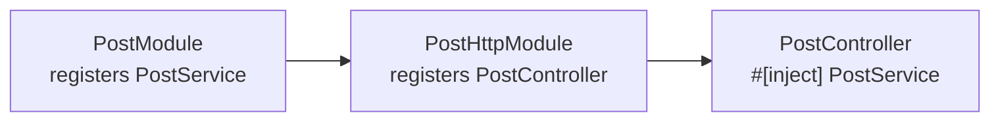
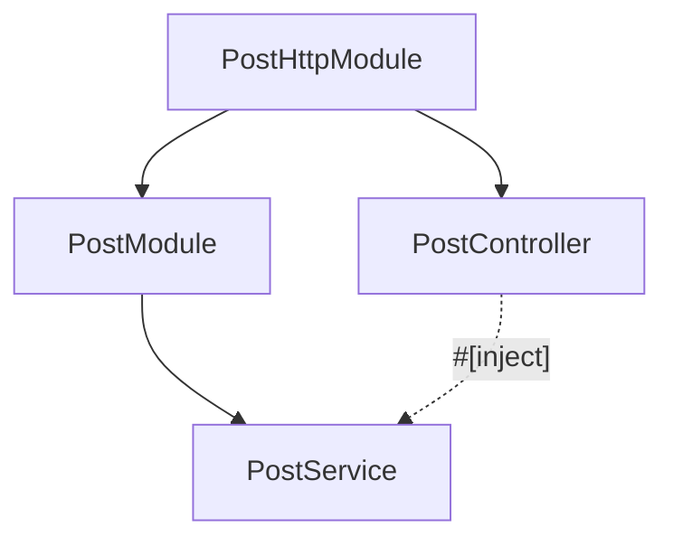
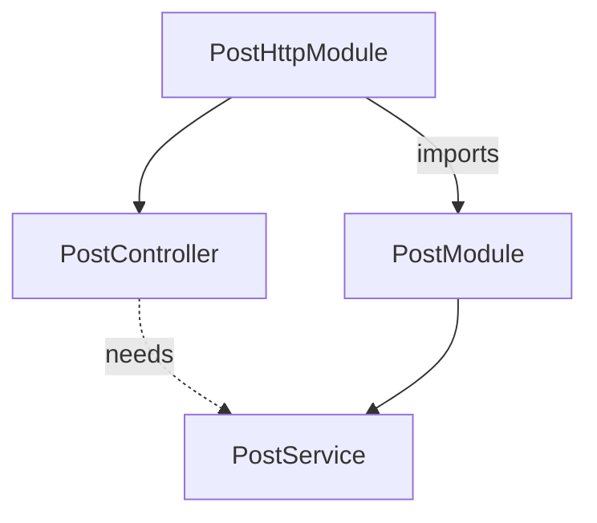

import { Aside } from '@astrojs/starlight/components';

This page continues the fictional **`blog`** app from
[Modules](/fundamentals/modules/). Once handlers live in `post/`, the
container still does the same job: build each provider once (or per
scope), wire `#[inject]` fields, fail at boot if something is unreachable.



## A provider in one glance

A provider is any struct the container can build. Mark it
`#[injectable]`, list it in a module's `providers = [...]`, declare
dependencies as `#[inject]` fields.

```rust title="crates/features/src/post/service.rs"
use std::sync::Arc;
use nest_rs_core::injectable;
use sea_orm::DatabaseConnection;

#[injectable]
pub struct PostService {
    #[inject]
    db: Arc<DatabaseConnection>,
}

impl PostService {
    pub async fn list(&self) -> Vec<Post> { /* ... */ }
}
```

`#[injectable]` registers `PostService` by `TypeId`. The
`#[inject] db` field says: resolve `Arc<DatabaseConnection>` from the
container when you build me — typically seeded by
`DatabaseModule::for_root(...)`.

Controllers, resolvers, and gateways are providers too — they just also
mount on a transport:

```rust title="crates/features/src/post/http/controller.rs"
use std::sync::Arc;
use nest_rs_http::{controller, routes};

#[controller(path = "/posts")]
pub struct PostController {
    #[inject]
    svc: Arc<PostService>,
}

#[routes]
impl PostController {
    #[get("/")]
    async fn list(&self) -> Vec<Post> {
        self.svc.list().await
    }
}
```

```rust title="crates/features/src/post/module.rs"
#[module(providers = [PostService])]
pub struct PostModule;
```

```rust title="crates/features/src/post/http/module.rs"
#[module(
    imports = [PostModule],
    providers = [PostController],
)]
pub struct PostHttpModule;
```

`PostModule` owns the service. `PostHttpModule` owns the controller and
imports the port so `PostController` can inject `PostService`.



## What counts as a provider

Anything with a framework struct-level decorator is a provider — built by
the container and listed in `providers = [...]`:

| Decorator | Role in `blog` |
|-----------|----------------|
| `#[injectable]` | `PostService` — data layer |
| `#[controller]` | `PostController` — HTTP routes |
| `#[interceptor]` | Cross-cutting HTTP wrapper (logging, DB context, …) |

Other transports use the same idea (`#[resolver]`, `#[gateway]`,
`#[processor]`, …) when you add them. See their categories when you need
them — not required to compose a minimal HTTP app.

Every provider implements `Discoverable`; transports mount only what the
import tree reaches ([Modules](/fundamentals/modules/#compose-the-root-module)).

## Scopes — singleton, request, transient

```rust
#[injectable]                    // singleton — default
pub struct PostService { /* ... */ }

#[injectable(scope = request)]   // one instance per request
pub struct RequestLogger { /* ... */ }

#[injectable(scope = transient)] // fresh instance every resolution
pub struct IdGenerator { /* ... */ }
```

| Scope | Built | Shared as |
|-------|-------|-----------|
| `singleton` (default) | Once at boot | `Arc<T>` everywhere |
| `request` | Once per request | Cached for that request |
| `transient` | On every resolution | Never cached |

**Singletons** — `PostService`, `PostController`, the DB pool: built at
boot, injected as `Arc<T>`.

**Request-scoped** — may inject singletons; singletons may **not**
inject request-scoped types (they exist before any request). Reach them
through the request boundary, not `#[inject]` on a singleton:

```rust
use nest_rs_http::Scoped;

#[get("/trace")]
async fn trace(&self, log: Scoped<RequestLogger>) -> String {
    log.line("listed posts");
    "ok".into()
}
```

HTTP installs a fresh request scope per call. GraphQL and MCP are
singleton-only for request scope today.

**Transient** — rebuild on every `Scoped<T>` / `get::<T>()` extraction.
Use for throw-away per-call state (a fresh correlation id, a one-shot
builder). A transient must not depend on itself — cycles panic at
resolution with a clear diagnostic.

<Aside type="note">
Most services in `post/` are **singletons**. Reach for `request` or
`transient` only when you need per-request or per-call isolation.
</Aside>

## The access graph — wiring checked at boot

The container is flat at runtime — every registered `TypeId` is
globally resolvable — but `#[module]` makes wiring **declarative**. At
boot the access graph checks: every `#[inject]` on a provider must be
reachable from that provider's module through `imports`, or be global
infrastructure (DB pool, config, …).

Typical mistake — controller registered without importing the port:

```rust
// ✗ PostModule not in imports — PostService unreachable here
#[module(providers = [PostController])]
pub struct PostHttpModule;
```

```text frame="terminal"
Error: module access violation:
  `PostController` (in module `PostHttpModule`) depends on `PostService`, but
  `PostHttpModule` imports no module that provides it. `PostService` is
  provided by `PostModule` — add `PostModule` to
  `#[module(imports = [...])]` of `PostHttpModule`.
```

The message names the consumer, the missing type, and the module that
owns it. Boot fails before HTTP listens — not on the first request.

The same check applies to layers bound with
`#[use_guards(...)]` / `#[use_filters(...)]` /
`#[use_interceptors(...)]`: if a controller lists a guard, its module
must import a module that provides that guard.



## Hiding the impl — `pub trait` + `as dyn Trait`

When another feature must call into `post/` without naming the concrete
struct, expose a `pub trait` and keep the impl module-private:

```rust title="crates/features/src/post/service.rs"
use std::sync::Arc;

#[async_trait]
pub trait PostService: Send + Sync {
    async fn list(&self) -> Result<Vec<Post>, Error>;
}

#[injectable]
pub(crate) struct PostServiceImpl {
    #[inject]
    db: Arc<DatabaseConnection>,
}

#[async_trait]
impl PostService for PostServiceImpl { /* ... */ }
```

```rust title="post/module.rs"
#[module(providers = [PostServiceImpl as dyn PostService])]
pub struct PostModule;
```

Consumers inject `Arc<dyn PostService>`, never `PostServiceImpl`. There
is **no `exports = [...]`** list — Rust visibility plus the
`as dyn Trait` binding is the encapsulation primitive.

<Aside>
When you do not need to hide the impl, register `PostService` directly
in `PostModule` — as in the snippets above. The trait pattern is optional:
use it when a second feature needs the port without coupling to your
concrete type.
</Aside>

## The runtime escape hatch

```rust
let svc: Arc<PostService> = container.get::<PostService>().unwrap();
```

`Container::get` / `get_dyn` resolve imperatively and **bypass the access
graph**. Fine for tests and rare bootstrap glue; in application code,
prefer `#[inject]` so refactors stay checked at boot.

<Aside type="note" title="What to remember">
- **Provider** — `#[injectable]` (or transport decorator) + listed in
  `providers = [...]`.
- **`#[inject]`** — declares a dependency; the access graph proves it is
  reachable through `imports`.
- **Port owns the service, adapter owns the controller** — `PostModule` +
  `PostHttpModule`, same as on the Modules page.
</Aside>

## Going further

- [Modules](/fundamentals/modules/) — where providers are listed and
  imports compose.
- [Guards](/fundamentals/guards/) — providers bound at the request edge.
- [Database / `Repo`](/database/) — the choke point every service reaches
  the DB through.
