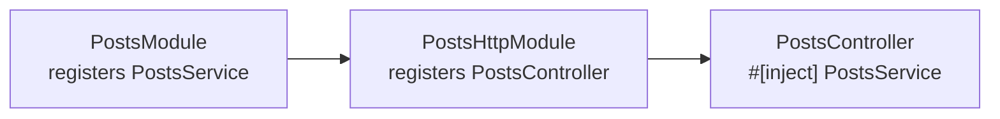
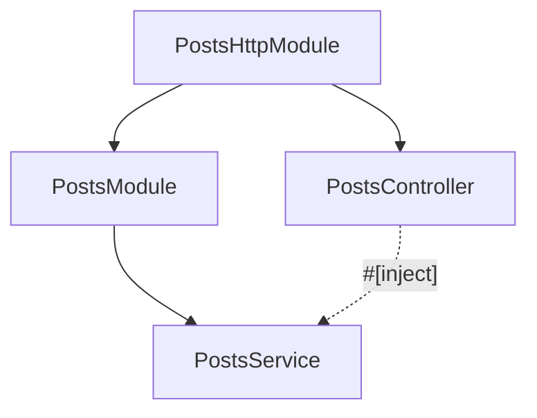
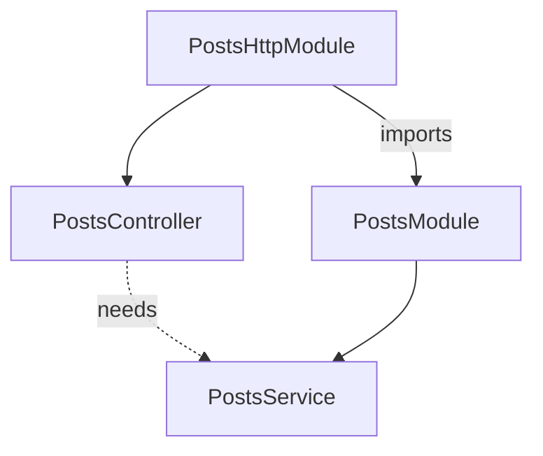

import { Aside } from '@astrojs/starlight/components';

This page continues **`blog`** from
[Modules](/fundamentals/modules/) — step ② onward, before the
[tutorial](/tutorial/) `posts/` layout. Once handlers live in `posts/`, the
container still does the same job: build each provider once (or per
scope), wire `#[inject]` fields, fail at boot if something is unreachable.



## A provider in one glance

A provider is any struct the container can build. Mark it
`#[injectable]`, list it in a module's `providers = [...]`, declare
dependencies as `#[inject]` fields.

```rust title="crates/features/src/posts/service.rs"
use std::sync::Arc;
use nest_rs_core::injectable;
use sea_orm::DatabaseConnection;

#[injectable]
pub struct PostsService {
    #[inject]
    db: Arc<DatabaseConnection>,
}

impl PostsService {
    pub async fn list(&self) -> Vec<Post> { /* ... */ }
}
```

`#[injectable]` registers `PostsService` by `TypeId`. The
`#[inject] db` field says: resolve `Arc<DatabaseConnection>` from the
container when you build me — typically seeded by
`DatabaseModule::for_root(...)`.

Controllers, resolvers, and gateways are providers too — they just also
mount on a transport:

```rust title="crates/features/src/posts/http/controller.rs"
use std::sync::Arc;
use nest_rs_http::{controller, routes};

#[controller(path = "/posts")]
pub struct PostsController {
    #[inject]
    svc: Arc<PostsService>,
}

#[routes]
impl PostsController {
    #[get("/")]
    async fn list(&self) -> Vec<Post> {
        self.svc.list().await
    }
}
```

```rust title="crates/features/src/posts/module.rs"
#[module(providers = [PostsService])]
pub struct PostsModule;
```

```rust title="crates/features/src/posts/http/module.rs"
#[module(
    imports = [PostsModule],
    providers = [PostsController],
)]
pub struct PostsHttpModule;
```

`PostsModule` owns the service. `PostsHttpModule` owns the controller and
imports the port so `PostsController` can inject `PostsService`.



## What counts as a provider

Anything with a framework struct-level decorator is a provider — built by
the container and listed in `providers = [...]`:

| Decorator | Role in `blog` |
|-----------|----------------|
| `#[injectable]` | `PostsService` — data layer |
| `#[controller]` | `PostsController` — HTTP routes |
| `#[interceptor]` | Cross-cutting HTTP wrapper (logging, DB context, …) |

Other transports use the same idea (`#[resolver]`, `#[gateway]`,
`#[processor]`, …) when you add them. See their categories when you need
them — not required to compose a minimal HTTP app.

Every provider implements `Discoverable`; transports mount only what the
import tree reaches ([Modules](/fundamentals/modules/#compose-the-root-module)).

## Scopes — singleton, request, transient

```rust
#[injectable]                    // singleton — default
pub struct PostsService { /* ... */ }

#[injectable(scope = request)]   // one instance per request
pub struct RequestLogger { /* ... */ }

#[injectable(scope = transient)] // fresh instance every resolution
pub struct IdGenerator { /* ... */ }
```

| Scope | Built | Shared as |
|-------|-------|-----------|
| `singleton` (default) | Once at boot | `Arc<T>` everywhere |
| `request` | Once per request | Cached for that request |
| `transient` | On every resolution | Never cached |

**Singletons** — `PostsService`, `PostsController`, the DB pool: built at
boot, injected as `Arc<T>`.

**Request-scoped** — may inject singletons; singletons may **not**
inject request-scoped types (they exist before any request). Reach them
through the request boundary, not `#[inject]` on a singleton:

```rust
use nest_rs_http::Scoped;

#[get("/trace")]
async fn trace(&self, log: Scoped<RequestLogger>) -> String {
    log.line("listed posts");
    "ok".into()
}
```

HTTP, GraphQL, and MCP each install a fresh request scope per call
(one per request for HTTP, one per operation for GraphQL and MCP).
Within a scope, request-scoped providers are cached and shared; across
scopes, fresh instances are built. GraphQL resolvers reach them with
`nest_rs_graphql::Scoped<T>` (from the async-graphql `&Context`), MCP
tools with `nest_rs_mcp::Scoped<T>` — the same shape as HTTP's
`Scoped<T>`. A request-scoped provider may itself inject another
request-scoped provider (both share the per-request cache); a cycle
panics at resolution with the named chain.

<Aside type="caution">
A `#[dataloader]` batch closure runs **off-task** (a spawned future),
so a request-scoped provider is not reachable inside batch
computation — batches re-establish ambient state through their own
`BatchContext` seam.
</Aside>

**Transient** — rebuild on every `Scoped<T>` / `get::<T>()` extraction.
Use for throw-away per-call state (a fresh correlation id, a one-shot
builder). A transient must not depend on itself — cycles panic at
resolution with a clear diagnostic.

<Aside type="note">
Most services in `posts/` are **singletons**. Reach for `request` or
`transient` only when you need per-request or per-call isolation.
</Aside>

## The access graph — wiring checked at boot

The container is flat at runtime — every registered `TypeId` is
globally resolvable — but `#[module]` makes wiring **declarative**. At
boot the access graph checks: every `#[inject]` on a provider must be
reachable from that provider's module through `imports`, or be global
infrastructure (DB pool, config, …).

Typical mistake — controller registered without importing the port:

```rust
// ✗ PostsModule not in imports — PostsService unreachable here
#[module(providers = [PostsController])]
pub struct PostsHttpModule;
```

{/* TODO(step8-evidence): capture verbatim boot output from a real failing run */}

```text frame="terminal"
Error: module access violation: `PostsController` (in module
  `PostsHttpModule`) depends on `PostsService`, but `PostsHttpModule`
  imports no module that provides it. `PostsService` is provided by
  `PostsModule` — add `PostsModule` to `#[module(imports = [...])]` of
  `PostsHttpModule`, or route the dependency through a module
  `PostsHttpModule` already imports.
```

The message names the consumer, the missing type, the owning module, and
both fixes — import the owner, or route through a module already imported.
Boot fails before HTTP listens — not on the first request.

The same check applies to layers bound with
`#[use_guards(...)]` / `#[use_filters(...)]` /
`#[use_interceptors(...)]`: if a controller lists a guard, its module
must import a module that provides that guard.



## Hiding the impl — `pub trait` + `as dyn Trait`

When another feature must call into `posts/` without naming the concrete
struct, expose a `pub trait` and keep the impl module-private:

```rust title="crates/features/src/posts/service.rs"
use std::sync::Arc;

#[async_trait]
pub trait PostsService: Send + Sync {
    async fn list(&self) -> Result<Vec<Post>, Error>;
}

#[injectable]
pub(crate) struct PostsServiceImpl {
    #[inject]
    db: Arc<DatabaseConnection>,
}

#[async_trait]
impl PostsService for PostsServiceImpl { /* ... */ }
```

```rust title="posts/module.rs"
#[module(providers = [PostsServiceImpl as dyn PostsService])]
pub struct PostsModule;
```

Consumers inject `Arc<dyn PostsService>`, never `PostsServiceImpl`. There
is **no `exports = [...]`** list — Rust visibility plus the
`as dyn Trait` binding is the encapsulation primitive.

When you do not need to hide the impl, register `PostsService` directly
in `PostsModule` — as in the snippets above. The trait pattern is optional:
use it when a second feature needs the port without coupling to your
concrete type.

## The runtime escape hatch

```rust
let svc: Arc<PostsService> = container.get::<PostsService>().unwrap();
```

`Container::get` / `get_dyn` resolve imperatively and **bypass the access
graph**. Fine for tests and rare bootstrap glue; in application code,
prefer `#[inject]` so refactors stay checked at boot.

<Aside type="note" title="What to remember">
- **Provider** — `#[injectable]` (or transport decorator) + listed in
  `providers = [...]`.
- **`#[inject]`** — declares a dependency; the access graph proves it is
  reachable through `imports`.
- **Port owns the service, adapter owns the controller** — `PostsModule` +
  `PostsHttpModule`, same as on the Modules page.
</Aside>

## Keyed providers — static roles

When several instances of **one** type coexist and differ only by config
— a primary and a replica `DatabaseConnection`, two cache pools — give
each a compile-time key instead of a wrapper type. Register with
`provide_keyed("primary", …)` and inject with `#[inject(key = "primary")]`;
the access graph validates a keyed dependency exactly like a bare one, so
a missing key fails boot naming the type and the key.

Keyed injection is for **static, compile-time-known roles**. It is the
opposite case from an **open, extensible set** discovered at runtime — a
plugin registry, the social-login providers — where the members are not
known in advance and each carries real per-member code. Those use the
inventory-discovery seam (a public trait + `inventory::submit!`), not a
key; see [social login](/security/authentication/social-login/) for the
canonical example.

## Going further

- [Modules](/fundamentals/modules/) — where providers are listed and
  imports compose.
- [Guards](/fundamentals/guards/) — providers bound at the request edge.
- [Database / `Repo`](/database/) — the choke point every service reaches
  the DB through.
